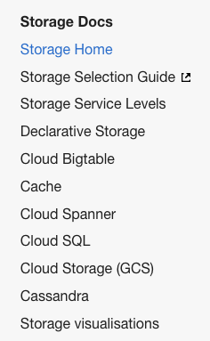
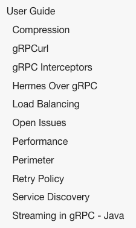

# Other Content Sections

These are sections and pages that comprise the the bulk of your documentation. Here are 2 examples.

## Example 1

You could put this general documentation in sections that are titled after the topics that most of the docs cover. For example, look at this table of contents used by the Storage team.

Notice how each of the top level sections are titled based on the topic of their contents (e.g. Cloud Bigtable, Cloud Spanner, Cloud SQL). All of these are "other" type sections organized by topic.

## Example 2

Here's another example from the gRPC team. They've put content under a top level parent titled "User Guide." This is yet another way to organize the general mass of pages in your Backstage space.

Aside from these examples, it's up to you to organize this "middle part" of your documentation. Reach out to the technical writers if you have any questions. We're on Slack at #tech-writing.
