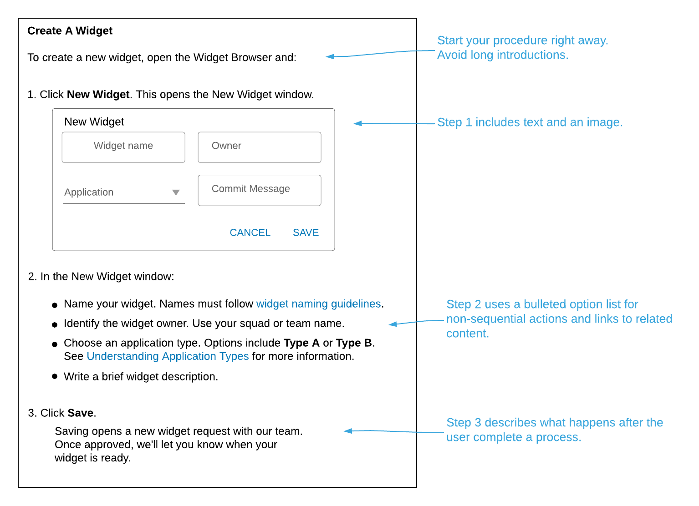

# Documentation for Simple Procedures

Task documentation breaks down a workflow into the sequential or non-sequential steps required to complete a process. Write task docs to explain how to use the thing you built rather than why you created it.

## Structure

This diagram demonstrates how to organize a simple task document:

!!! important
    Describing each step in a task is essential. This includes obvious steps like "Click **Save**." After all, simple actions might not be self-evident so you need to include them. For your readers, few things are more maddening than vague or incomplete instructions. You just gotta do it.

## Features

Common features of task documentation include:

- Descriptive titles that suggest or summarize the main topic.
- Numbered steps (if steps must be completed sequentially).
- **Bold text** for UI elements that you interact with. See the section on Bold Text LINK TBD.
- Bulleted steps (if steps don't need to follow in sequential order).
- The text "_(Optional)_" at the beginning of a step to indicate that it isn't required.
- Images.
- Separate sections to break up long procedures. See also [Documentation for Complex Procedures](tasks_complex.md).

## Style advice

When writing task documentation:

- Start the document title with a verb that matches the procedure (e.g., Create, Build, Configure, Implement, etc.). This indicates the document's type (task) and content (steps on how to do something).

- Start the procedure right away. Avoid long introductions or overviews (use a concept page for that). It is OK to note task pre- and post-requisites or provide context, but try to start the task steps quickly.

- Start each step using a verb in the [imperative mood](https://en.wikipedia.org/wiki/Imperative_mood). For example, "Click this," "Select that," "Choose X." Procedural steps are commands, not requests.

- Link to other docs that describe step options or strategies. You can list the options (try bullets), but don't clutter up instructions with extensive explanations. Put that information in a separate document.

- Follow the advice in Writing About UI Controls LINK TBD when describing user interactions with UI features.

## What to avoid

Don't start your task doc with a long introduction or "overview" content. Put this information in a separate [concept document](concepts.md). Remember, your users read task documents to complete a process. They want instructions. Don't bury the steps under a long introduction.
