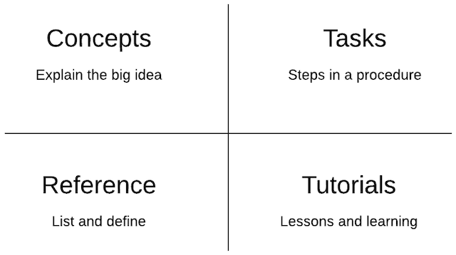

# Topic-Based Writing and Document Types

Topic-based writing reduces documentation for complex systems, processes, or workflows into discrete content categories or types. With a topic-based approach, each page covers a single topic only (1 page = 1 topic).

## Topic types

You can organize documentation into 4 main topic types.

## Types and contents

Each topic type contains specific information that the others don't. Excluding content based on topic helps you write because you don’t have to include everything in one long article. Let’s review the basic characteristics of each type.

| **Type** | **Contents** |
|----|----|
| **Concept** | Concept documents explain ideas and describe how things work. Think of a concept piece as a deep, substantial, and informative discussion with your colleagues. A concept document doesn't contain task steps or procedures. See [Concept Documentation](concepts.md) for writing advice and examples. |
| **Task** | Task documents provide step-by-step instructions that show you how to complete a procedure. They organize content into ordered or unordered lists. A task document doesn't include long blocks of conceptual information. See [Documenting Simple Procedures](tasks_simple.md) or [Documenting Complex Procedures](tasks_complex.md) for writing advice and examples.
| **Reference** | Reference documents list and define or describe things (e.g., UI features, dataset fields, glossary terms, API methods, FAQs, ADRs. These are hybrid documents because they can include information found in the other document types. See [Reference Documentation](reference.md) for writing advice and examples.
| **Tutorials** | Tutorials are a mixed document type. They can include the information found in all the other document types. This guide does not cover tutorials. |

## Help and support

Placeholder for generic help text and links.

*[ADRs]: Architectural Decision Records
