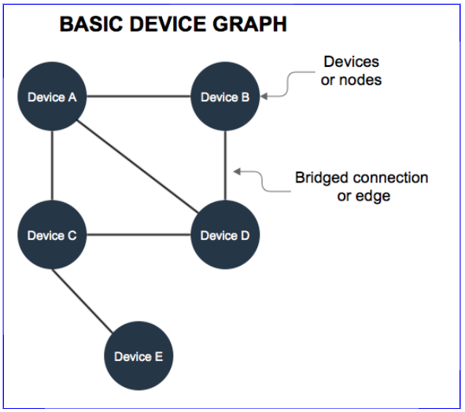

# Device Graph Overview

The _Device Graph_ consists of internet-enabled devices seen on a network and the connections (or edges) shared between each device. In the Device Graph, a "connection" is not a physical link between devices. In this case, the "connection" or "edge" refers to a virtual relationship between devices. This relationship is based on how recently and frequently 2 (or more) devices are seen together on a network.

## Building the Device Graph

We build the device graph with a process known as bridging. Bridging lets our systems identify and make connections between devices on the same network. The result is a map of all the devices on a particular network. In addition to bridging, our systems create and assigns various numeric scores to the connections between each device. These scores are designed to quantify relationships (strong or weak) among devices in the graph.

## Composition

A typical device graph contains:

- Desktop and laptop computers
- Tablets
- Mobile phones
- Game consoles
- Internet-enabled television sets
- Other networked devices

## Data sources

The Device Graph builds device connections from:

- HTTP headers in an ad impression.
- API and SDK calls.
- Information provided by third-party data partners.

See the following table for more information.

<html>
<table border="1">
<tr bgcolor=#E5E8E8>
<th>Data source</th><th>Description</th>
</tr>
<tr>
<td><b>HTTP calls</b></td>
<td>HTTP calls provide the largest data sets used to build the Device Graph. These calls come directly from:
    <ul>
        <li>Webpage code</li>
        <li>Server-to-server integrations with other data providers or sources</li>
    </ul>
This data includes, but is not limited to:
    <ul>
        <li>Headers passed in an HTTP call</li>
        <li>Any other data points passed in from third-party partners/integrations</li>
    </ul>
    <b>Note:</b> We do not use or accept Personally Identifiable Information (PII) to bridge devices.
</td>
</tr>
<tr>
<td><b>Authenticated sources</b></td>
<td>Purchased data from sites that require user authentication. User authentication provides data we use to help build the Device Graph.
</td>
</tr>
<td><b>APIs or SDKs</b></td>
<td>This is data returned by our APIs or Android and iOS SDKs.</td>
</tr>
<tr>
<td><b>Location-based sources</b></td>
<td>Data from airport, stadium, hotel networks, and similar venues.</td>
</tr>
</table>
</html>

