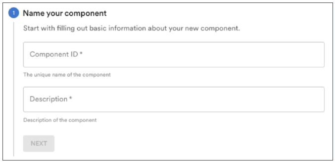
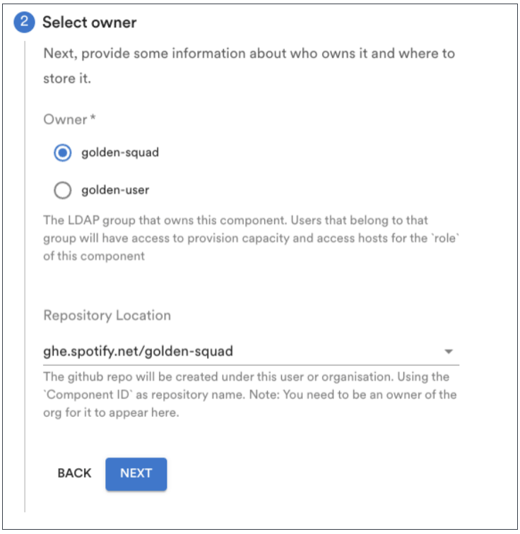
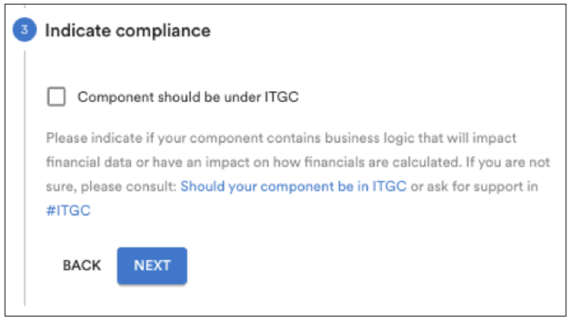
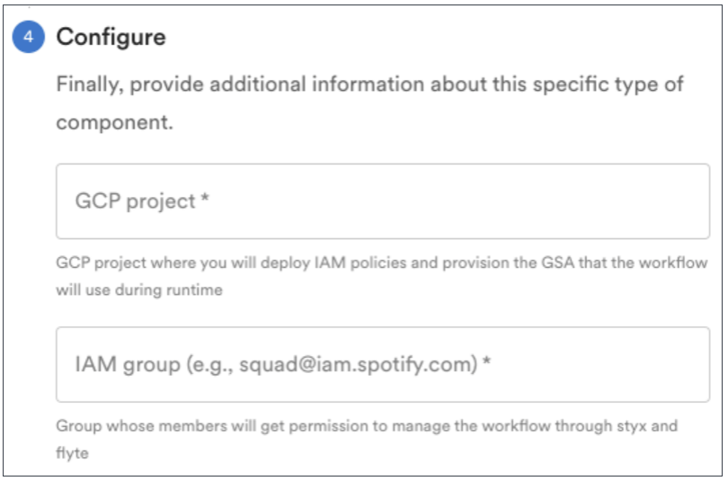
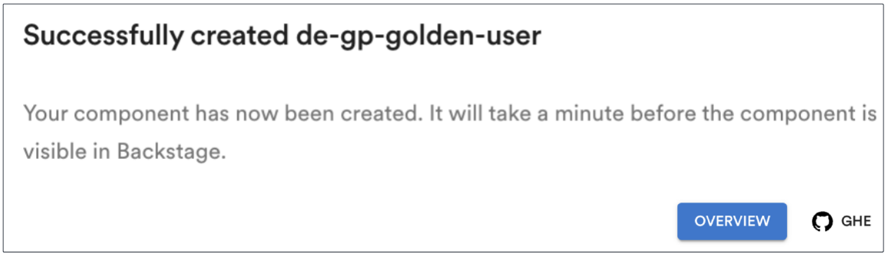

# Create a Data Workflow Component

We'll use the [Styx Scheduled Scio Pipeline template (Flyte)](../placeholder.md) on Backstage to create a new GHE repository for your data workflow component. Follow these instructions to get started.

## Component creation steps

1. Click the link above to start the creation process. This opens the template section shown below.

    

1. Identify and describe your component. Click **Next** to continue.

    - **Component ID**: We suggest `de-gp-<username>` so others can see this belongs to you.
    - **Description**: A concise description helps you, and others, understand what the component is or does.

1. Select an owner and GHE repo for your component. We recommend using your squad name as the owner and setting the repository to a space used by your team's part of the organization. Click **Next** to continue.

    

1. _(Optional)_ Select the ITGC checkbox only if your component is subject to ITGC compliance requirements. See the [ITGC Backstage site](../placeholder.md) for more information or if you have questions about ITGC. Click **Next** to continue.

    

1. Identify your GCP project and IAM group.

    - **GCP project**: Use one of the projects your squad owns. If you're unsure, ask a squad-mate or [create a new project](../placeholder.md) on Backstage.

    - **IAM group**: Use your squad IAM group, which you can find in [Band Manager](../placeholder.md). It's on your squad's page in the Details section.

    

1. Review your workflow, make changes (if needed), and click **Create Component** to finish.

    

## Post-configuration steps

Backstage may take a few moments to create your component. It will let you know when the component is ready. Also, you can click **GHE** to see your new workflow repo.

